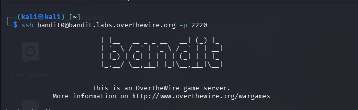
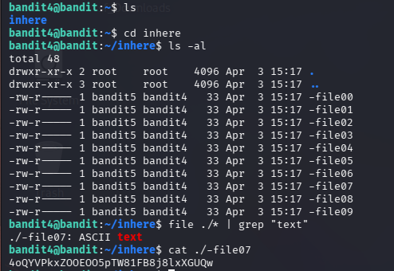
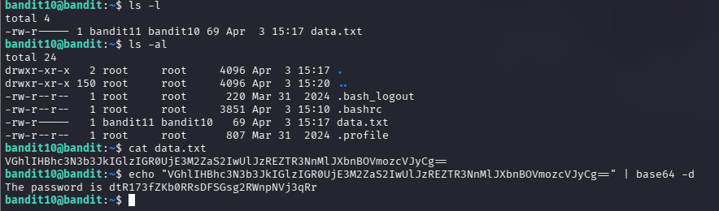

# BANDIT : Over The Wire



## LEVEL :`bandit0 → bandit1`

The password for the next level is stored in a file called **readme** located in the home directory. Use this password to log into bandit1 using SSH. Whenever you find a password for a level, use SSH (on port 2220) to log into that level and continue the game.


### **Passwd** : `ZjLjTmM6FvvyRnrb2rfNWOZOTa6ip5If`

## LEVEL :`bandit1 → bandit2`

Connect to the server of bandit1 before solving this using : 

`ssh [bandit1@bandit.labs.overthewire.org](mailto:bandit1@bandit.labs.overthewire.org) -p 2220`

The password for the next level is stored in a file called - located in the home directory.


### **Passwd : `263JGJPfgU6LtdEvgfWU1XP5yac29mFx`**

## LEVEL :`bandit2 → bandit3`

The password for the next level is stored in a file called `--spaces in this filename--` located in the home directory.


### **Passwd :`MNk8KNH3Usiio41PRUEoDFPqfxLPlSmx`**

## LEVEL :`bandit3 → bandit4`

The password for the next level is stored in a hidden file in inhere directory.


### Passwd : `2WmrDFRmJIq3IPxneAaMGhap0pFhF3NJ`

## LEVEL :`bandit4 → bandit5`

The password for the next level is stored in the only human-readable file in the **inhere** directory. Tip: if your terminal is messed up, try the “reset” command.



### Passwd : `4oQYVPkxZOOEOO5pTW81FB8j8lxXGUQw`

## LEVEL :`bandit5 → bandit6`

The password for the next level is stored in a file somewhere under the **inhere** directory and has all of the following properties:

- human-readable
- 1033 bytes in size
- not executable


### Passwd : `HWasnPhtq9AVKe0dmk45nxy20cvUa6EG`

## LEVEL :`bandit6 → bandit7`

The password for the next level is stored **somewhere on the server** and has all of the following properties:

- owned by user bandit7
- owned by group bandit6
- 33 bytes in size


### Passwd : `morbNTDkSW6jIlUc0ymOdMaLnOlFVAaj`

## LEVEL :`bandit7 → bandit8`

The password for the next level is stored in the file **data.txt** next to the word **millionth.**


### Passwd : `dfwvzFQi4mU0wfNbFOe9RoWskMLg7eEc`

## LEVEL :`bandit8 → bandit9`

The password for the next level is stored in the file **data.txt** and is the only line of text that occurs only once.


### Passwd : `4CKMh1JI91bUIZZPXDqGanal4xvAg0JM`

## LEVEL :`bandit9→ bandit10`

The password for the next level is stored in the file **data.txt** in one of the few human-readable strings, preceded by several ‘=’ characters.


### Passwd : `FGUW5ilLVJrxX9kMYMmlN4MgbpfMiqey`

## LEVEL :`bandit10 → bandit11`

The password for the next level is stored in the file **data.txt**, which contains base64 encoded data.



### Passwd : `dtR173fZKb0RRsDFSGsg2RWnpNVj3qRr`

## LEVEL :`bandit11 → bandit12`

The password for the next level is stored in the file **data.txt**, where all lowercase (a-z) and uppercase (A-Z) letters have been rotated by 13 positions.


### Passwd : `7x16WNeHIi5YkIhWsfFIqoognUTyj9Q4`

## LEVEL :`bandit12 → bandit13`

The password for the next level is stored in the file **data.txt**, which is a hexdump of a file that has been repeatedly compressed. For this level it may be useful to create a directory under /tmp in which you can work. Use mkdir with a hard to guess directory name. Or better, use the command “mktemp -d”. Then copy the datafile using cp, and rename it using mv (read the manpages!)


### Passwd : `FO5dwFsc0cbaIiH0h8J2eUks2vdTDwAn`

## LEVEL :`bandit13 → bandit14`

The password for the next level is stored in **/etc/bandit_pass/bandit14 and can only be read by user bandit14**. For this level, you don’t get the next password, but you get a private SSH key that can be used to log into the next level. Look at the commands that logged you into previous bandit levels, and find out how to use the key for this level.


### Passwd : `MU4VWeTyJk8ROof1qqmcBPaLh7lDCPvS`

## LEVEL :`bandit14 → bandit15`

The password for the next level can be retrieved by submitting the password of the current level to **port 30000 on localhost**.


### Passwd : `8xCjnmgoKbGLhHFAZlGE5Tmu4M2tKJQo`

## LEVEL :`bandit15 → bandit16`

The password for the next level can be retrieved by submitting the password of the current level to **port 30001 on localhost** using SSL/TLS encryption.


### **Passwd : `kSkvUpMQ7lBYyCM4GBPvCvT1BfWRy0Dx`**

## LEVEL :`bandit16 → bandit17`

The credentials for the next level can be retrieved by submitting the password of the current level to **a port on localhost in the range 31000 to 32000**. First find out which of these ports have a server listening on them. Then find out which of those speak SSL/TLS and which don’t. There is only 1 server that will give the next credentials, the others will simply send back to you whatever you send to it.


### PRIVATE SSH KEY :

```c
**----BEGIN RSA PRIVATE KEY-----
MIIEogIBAAKCAQEAvmOkuifmMg6HL2YPIOjon6iWfbp7c3jx34YkYWqUH57SUdyJ
imZzeyGC0gtZPGujUSxiJSWI/oTqexh+cAMTSMlOJf7+BrJObArnxd9Y7YT2bRPQ
Ja6Lzb558YW3FZl87ORiO+rW4LCDCNd2lUvLE/GL2GWyuKN0K5iCd5TbtJzEkQTu
DSt2mcNn4rhAL+JFr56o4T6z8WWAW18BR6yGrMq7Q/kALHYW3OekePQAzL0VUYbW
JGTi65CxbCnzc/w4+mqQyvmzpWtMAzJTzAzQxNbkR2MBGySxDLrjg0LWN6sK7wNX
x0YVztz/zbIkPjfkU1jHS+9EbVNj+D1XFOJuaQIDAQABAoIBABagpxpM1aoLWfvD
KHcj10nqcoBc4oE11aFYQwik7xfW+24pRNuDE6SFthOar69jp5RlLwD1NhPx3iBl
J9nOM8OJ0VToum43UOS8YxF8WwhXriYGnc1sskbwpXOUDc9uX4+UESzH22P29ovd
d8WErY0gPxun8pbJLmxkAtWNhpMvfe0050vk9TL5wqbu9AlbssgTcCXkMQnPw9nC
YNN6DDP2lbcBrvgT9YCNL6C+ZKufD52yOQ9qOkwFTEQpjtF4uNtJom+asvlpmS8A
vLY9r60wYSvmZhNqBUrj7lyCtXMIu1kkd4w7F77k+DjHoAXyxcUp1DGL51sOmama
+TOWWgECgYEA8JtPxP0GRJ+IQkX262jM3dEIkza8ky5moIwUqYdsx0NxHgRRhORT
8c8hAuRBb2G82so8vUHk/fur85OEfc9TncnCY2crpoqsghifKLxrLgtT+qDpfZnx
SatLdt8GfQ85yA7hnWWJ2MxF3NaeSDm75Lsm+tBbAiyc9P2jGRNtMSkCgYEAypHd
HCctNi/FwjulhttFx/rHYKhLidZDFYeiE/v45bN4yFm8x7R/b0iE7KaszX+Exdvt
SghaTdcG0Knyw1bpJVyusavPzpaJMjdJ6tcFhVAbAjm7enCIvGCSx+X3l5SiWg0A
R57hJglezIiVjv3aGwHwvlZvtszK6zV6oXFAu0ECgYAbjo46T4hyP5tJi93V5HDi
Ttiek7xRVxUl+iU7rWkGAXFpMLFteQEsRr7PJ/lemmEY5eTDAFMLy9FL2m9oQWCg
R8VdwSk8r9FGLS+9aKcV5PI/WEKlwgXinB3OhYimtiG2Cg5JCqIZFHxD6MjEGOiu
L8ktHMPvodBwNsSBULpG0QKBgBAplTfC1HOnWiMGOU3KPwYWt0O6CdTkmJOmL8Ni
blh9elyZ9FsGxsgtRBXRsqXuz7wtsQAgLHxbdLq/ZJQ7YfzOKU4ZxEnabvXnvWkU
YOdjHdSOoKvDQNWu6ucyLRAWFuISeXw9a/9p7ftpxm0TSgyvmfLF2MIAEwyzRqaM
77pBAoGAMmjmIJdjp+Ez8duyn3ieo36yrttF5NSsJLAbxFpdlc1gvtGCWW+9Cq0b
dxviW8+TFVEBl1O4f7HVm6EpTscdDxU+bCXWkfjuRb7Dy9GOtt9JPsX8MBTakzh3
vBgsyi/sN3RqRBcGU40fOoZyfAMT8s1m/uYv52O6IgeuZ/ujbjY=
-----END RSA PRIVATE KEY-----**
```

## LEVEL :`bandit17 → bandit18`

There are 2 files in the **homedirectory: passwords.old and passwords.new**. The password for the next level is in **passwords.new** and is the only line that has been changed between **passwords.old and passwords.new.**


> ***Paste the private key in bandit17.key.***
> 

> ***After pasting , change permissions using `chmod 600 bandit17.key` & then log into level 17 using :                                                                              `ssh -i bandit17.key [bandit17@bandit.labs.overthewire.org](mailto:bandit17@bandit.labs.overthewire.org) -p 2220`***
> 


### Passwd : `x2gLTTjFwMOhQ8oWNbMN362QKxfRqGlO`

## LEVEL :`bandit18 → bandit19`

The password for the next level is stored in a file **readme** in the homedirectory. Unfortunately, someone has modified **.bashrc** to log you out when you log in with SSH.


### Passwd : `cGWpMaKXVwDUNgPAVJbWYuGHVn9zl3j8`

## LEVEL :`bandit19 → bandit20`

To gain access to the next level, you should use the setuid binary in the homedirectory. Execute it without arguments to find out how to use it. The password for this level can be found in the usual place (/etc/bandit_pass), after you have used the setuid binary.


### Passwd : `0qXahG8ZjOVMN9Ghs7iOWsCfZyXOUbYO`

## LEVEL :`bandit20 → bandit21`


### Passwd : `EeoULMCra2q0dSkYj561DX7s1CpBuOBt`

## LEVEL :`bandit21 → bandit22`

A program is running automatically at regular intervals from **cron**, the time-based job scheduler. Look in **/etc/cron.d/** for the configuration and see what command is being executed.


### Passwd : `tRae0UfB9v0UzbCdn9cY0gQnds9GF58Q`

## LEVEL :`bandit22 → bandit23`

A program is running automatically at regular intervals from **cron**, the time-based job scheduler. Look in **/etc/cron.d/** for the configuration and see what command is being executed.

**NOTE:** Looking at shell scripts written by other people is a very useful skill. The script for this level is intentionally made easy to read. If you are having problems understanding what it does, try executing it to see the debug information it prints.


### Passwd : `0Zf11ioIjMVN551jX3CmStKLYqjk54Ga`

## LEVEL :`bandit23 → bandit24`

A program is running automatically at regular intervals from **cron**, the time-based job scheduler. Look in **/etc/cron.d/** for the configuration and see what command is being executed.


### Passwd : `gb8KRRCsshuZXI0tUuR6ypOFjiZbf3G8`

## LEVEL :`bandit24 → bandit25`

A daemon is listening on port 30002 and will give you the password for bandit25 if given the password for bandit24 and a secret numeric 4-digit pincode. There is no way to retrieve the pincode except by going through all of the 10000 combinations, called brute-forcing.


#### **nano [brute.sh](http://brute.sh) :**


### Passwd :  `iCi86ttT4KSNe1armKiwbQNmB3YJP3q4`

## LEVEL :`bandit25 → bandit26`

Logging in to bandit26 from bandit25 should be fairly easy… The shell for user bandit26 is not **/bin/bash**, but something else. Find out what it is, how it works and how to break out of it.


### Passwd : `s0773xxkk0MXfdqOfPRVr9L3jJBUOgCZ`

## LEVEL :`bandit26 → bandit27`

Good job getting a shell! Now hurry and grab the password for bandit27.


### Passwd : `upsNCc7vzaRDx6oZC6GiR6ERwe1MowGB`

## LEVEL :`bandit27 → bandit28`

There is a git repository at `ssh://bandit27-git@bandit.labs.overthewire.org/home/bandit27-git/repo` via the port `2220`. The password for the user `bandit27-git` is the same as for the user `bandit27`.


### Passwd : `Yz9IpL0sBcCeuG7m9uQFt8ZNpS4HZRcN`

## LEVEL :`bandit28 → bandit29`

There is a git repository at `ssh://bandit28-git@bandit.labs.overthewire.org/home/bandit28-git/repo` via the port `2220`. The password for the user `bandit28-git` is the same as for the user `bandit28`.
From your local machine (not the OverTheWire machine!), clone the repository and find the password for the next level. This needs git installed locally on your machine.


### Passwd : `4pT1t5DENaYuqnqvadYs1oE4QLCdjmJ7`

## LEVEL :`bandit29 → bandit30`

There is a git repository at `ssh://bandit29-git@bandit.labs.overthewire.org/home/bandit29-git/repo` via the port `2220`. The password for the user `bandit29-git` is the same as for the user `bandit29`.

From your local machine (not the OverTheWire machine!), clone the repository and find the password for the next level. This needs git installed locally on your machine.


### Passwd : `qp30ex3VLz5MDG1n91YowTv4Q8l7CDZL`

## LEVEL :`bandit30 → bandit31`

There is a git repository at `ssh://bandit30-git@bandit.labs.overthewire.org/home/bandit30-git/repo` via the port `2220`. The password for the user `bandit30-git` is the same as for the user `bandit30`.

From your local machine (not the OverTheWire machine!), clone the repository and find the password for the next level. This needs git installed locally on your machine


### Passwd : `fb5S2xb7bRyFmAvQYQGEqsbhVyJqhnDy`

## LEVEL :`bandit31 → bandit32`

There is a git repository at `ssh://bandit31-git@bandit.labs.overthewire.org/home/bandit31-git/repo` via the port `2220`. The password for the user `bandit31-git` is the same as for the user `bandit31`.

From your local machine (not the OverTheWire machine!), clone the repository and find the password for the next level. This needs git installed locally on your machine.

```c
                              #FLOW OF COMMANDS#

mkdir /tmp/myrepo31
cd /tmp/myrepo31
git clone ssh://bandit31-git@bandit.labs.overthewire.org:2220/home/bandit31-git/repo
cd repo

git config --global user.email "GMAIL"
git config --global user.name "USERNAME"

echo "May I come in?" > key.txt

git add -f key.txt

git commit -m "push key"
git push origin master
```

### Passwd : `3O9RfhqyAlVBEZpVb6LYStshZoqoSx5K`